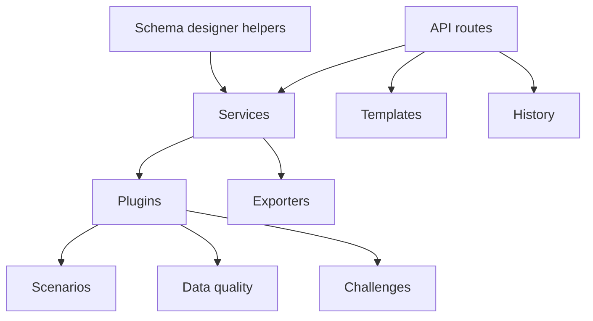
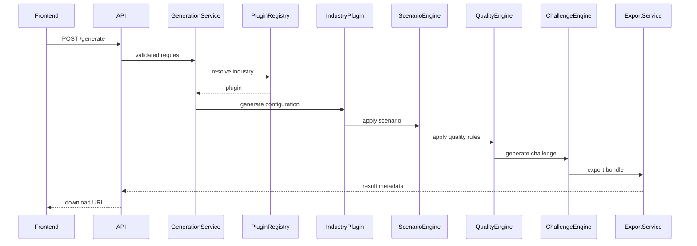
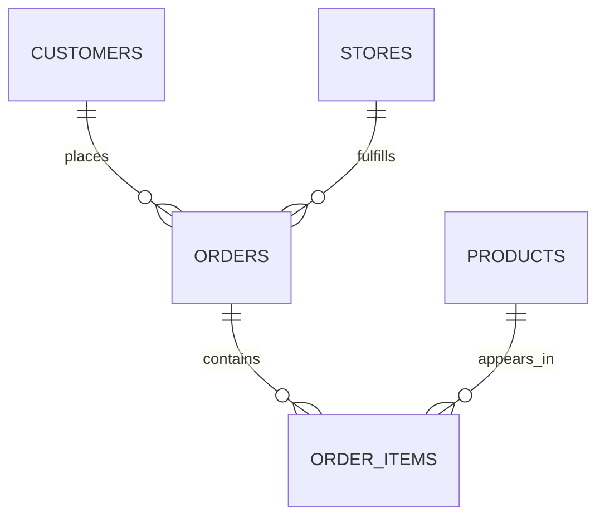
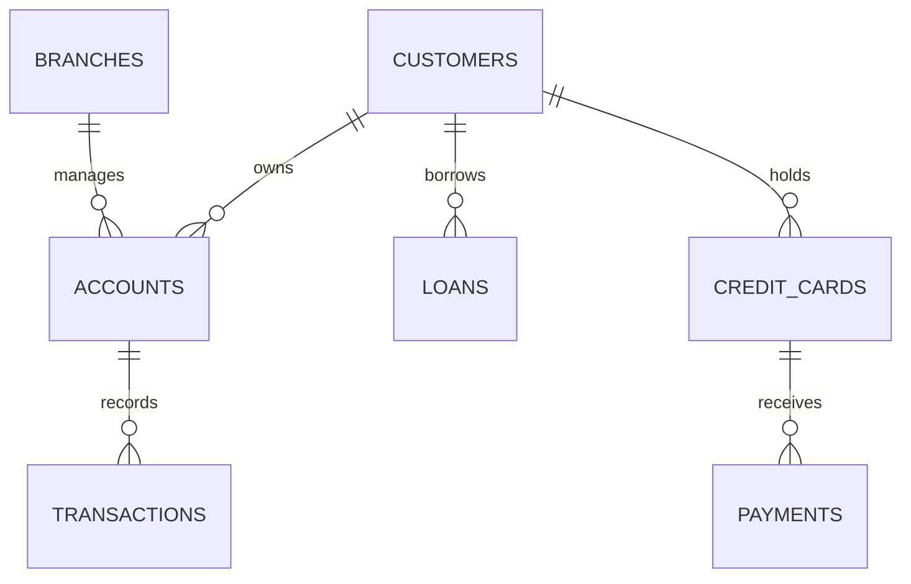

# Architecture

## System overview

Synthetica has a Next.js frontend, FastAPI API, industry plugin registry, and
in-process Pandas generation pipeline. Templates and history currently use
JSON-backed repositories. The export layer writes a local bundle and ZIP file.

```mermaid
flowchart LR
  User --> Web[Next.js Frontend]
  Web --> API[FastAPI API]
  API --> Service[Generation Service]
  Service --> Registry[Industry Plugin Registry]
  Registry --> Plugin[Industry Plugin]
  Plugin --> Generator[Dataset Generator]
  Generator --> Scenario[Scenario Engine]
  Scenario --> Quality[Data Quality Engine]
  Quality --> Challenge[Challenge Engine]
  Challenge --> Export[Export Service]
  Export --> Zip[ZIP Download]
```

## Backend components

## Frontend architecture

The App Router provides the public landing page, `/workspace`, templates,
history, and schema designer pages. Reusable components provide application
shells, forms, brand assets, cards, and summaries. Hooks use TanStack Query for
remote state; services wrap API calls; types describe API contracts; React Hook
Form and Zod validate workspace input.

## Plugin lifecycle

1. Plugins are discovered and registered.
2. The frontend loads plugin metadata from `/industries`.
3. The user submits a configuration map for a selected plugin.
4. The plugin validates configuration and generates tables.
5. A scenario and quality rules modify those tables.
6. A challenge pack is generated.
7. Exporters create the downloadable bundle.

## Data generation sequence

## Data model examples

### Retail

### Banking

## Configuration flow

`app.core.settings.Settings` loads `.env` values. Current settings include
`EXPORT_DIR`, `CORS_ORIGINS`, `MAX_DATASET_ROWS`, API prefix, rate limits, and
local template/history directories. The frontend reads `NEXT_PUBLIC_API_URL`.
`API URL` is a deployment concept rather than a backend setting name.

## Error handling

Pydantic returns validation errors for invalid payloads. Plugin validation
rejects unsupported industries or scenarios. Download routes return `404` for
missing files or invalid paths. Export and plugin failures are logged and
surface as API failures; plugin discovery failures prevent the affected plugin
from being available.

## Security considerations

Inputs and row limits are validated. Download routes allow ZIP files and a
specific challenge PDF only, resolve paths beneath the export root, and reject
traversal attempts. CORS is configured from settings. Local exports are
temporary/demo-friendly storage; public deployments should restrict access,
manage retention, and use durable object storage.

## Scalability

Current generation is Pandas in-memory, exports use the local filesystem, and
templates/history are JSON-backed. Planned production options include
PostgreSQL, object storage, background jobs, Redis, Celery or RQ, and
horizontally scaled API workers.
